# 🤖 Portal de Publicación Multi-Red Social con IA

Sistema completo de gestión y publicación automatizada en redes sociales utilizando inteligencia artificial (Google Gemini) para adaptar contenido a diferentes plataformas.

## 📋 Descripción del Proyecto

Este proyecto es un portal web full-stack que permite crear una publicación base y automáticamente adaptarla para 5 redes sociales diferentes (Facebook, Instagram, LinkedIn, WhatsApp y TikTok) utilizando IA. El sistema genera contenido optimizado para cada plataforma y permite publicar directamente desde la interfaz web.

### ✨ Características Principales

- **Adaptación Inteligente**: Utiliza Google Gemini para adaptar contenido según las mejores prácticas de cada red social
- **Publicación Automatizada**: Publica directamente en Facebook, Instagram, LinkedIn y WhatsApp
- **Preview y Edición**: Revisa y edita las adaptaciones antes de publicar
- **Dashboard Completo**: Visualiza historial, estadísticas y estado de publicaciones
- **Manejo Robusto de Errores**: Sistema de reintentos con backoff exponencial
- **Notificaciones**: Alertas de éxito/error en consola con logging detallado

## 🏗️ Arquitectura del Sistema

```mermaid
graph TB
    subgraph Frontend
        A[React App] --> B[Create Post Page]
        A --> C[Preview Page]
        A --> D[Dashboard]
    end
    
    subgraph Backend
        E[Django REST API] --> F[LLM Service]
        E --> G[Social Service]
        E --> H[Retry Service]
        E --> I[Notification Service]
        F --> J[Google Gemini API]
        G --> K[Facebook API]
        G --> L[Instagram API]
        G --> M[LinkedIn API]
        G --> N[WhatsApp/Twilio API]
    end
    
    subgraph Database
        O[(SQLite)]
    end
    
    A -->|HTTP Requests| E
    E -->|Store/Retrieve| O
    
    style A fill:#61dafb
    style E fill:#092e20
    style J fill:#4285f4
```



## 🛠️ Tecnologías Utilizadas

### Frontend
- **React 19** - Librería UI
- **React Router 6** - Navegación multi-página
- **Bootstrap 5** - Framework CSS
- **Axios** - Cliente HTTP
- **Vite** - Build tool y dev server

### Backend
- **Django 4.x** - Framework web
- **Django REST Framework** - API REST
- **Google Generative AI (Gemini)** - Adaptación de contenido con IA
- **SQLite** - Base de datos
- **Requests** - Cliente HTTP para APIs externas

### APIs Externas
- Facebook Graph API v19.0
- Instagram Graph API
- LinkedIn API v2
- Twilio API (WhatsApp)
- Google Gemini API

## 📦 Instalación y Configuración

### Prerrequisitos

- Python 3.8+
- Node.js 16+
- npm o yarn
- Cuentas y credenciales de API para:
  - Google Gemini
  - Facebook/Instagram Business
  - LinkedIn
  - Twilio (WhatsApp)

### 1. Clonar el Repositorio

```bash
git clone <repository-url>
cd "LLM Topicos"
```

### 2. Configurar Backend

```bash
cd backend

# Crear entorno virtual
python -m venv venv

# Activar entorno virtual
# Windows:
venv\Scripts\activate
# Linux/Mac:
source venv/bin/activate

# Instalar dependencias
pip install -r requirements.txt

# Crear archivo .env (ver sección de Variables de Entorno)
# Copiar .env.example a .env y completar con tus credenciales

# Ejecutar migraciones
python manage.py makemigrations
python manage.py migrate

# Crear superusuario (opcional)
python manage.py createsuperuser
```

### 3. Configurar Frontend

```bash
cd ../frontend

# Instalar dependencias
npm install
```

## 🔑 Variables de Entorno

Crea un archivo `.env` en la carpeta `backend/` con las siguientes variables:

```env
# Google Gemini API
GEMINI_API_KEY=tu_api_key_de_gemini

# Facebook/Instagram
FACEBOOK_PAGE_ID=tu_page_id
FACEBOOK_ACCESS_TOKEN=tu_access_token_de_larga_duracion
INSTAGRAM_ACCOUNT_ID=tu_instagram_business_account_id

# LinkedIn
LINKEDIN_ACCESS_TOKEN=tu_linkedin_access_token

# Twilio (WhatsApp)
TWILIO_ACCOUNT_SID=tu_twilio_account_sid
TWILIO_AUTH_TOKEN=tu_twilio_auth_token
TWILIO_WHATSAPP_FROM=whatsapp:+14155238886
```

### Cómo Obtener las Credenciales

#### Google Gemini API
1. Visita [Google AI Studio](https://makersuite.google.com/app/apikey)
2. Crea un nuevo proyecto
3. Genera una API Key

#### Facebook/Instagram
1. Crea una [Facebook App](https://developers.facebook.com/)
2. Agrega el producto "Facebook Login"
3. Genera un token de acceso de larga duración
4. Conecta tu página de Facebook e Instagram Business

#### LinkedIn
1. Crea una [LinkedIn App](https://www.linkedin.com/developers/apps)
2. Solicita permisos: `w_member_social`, `r_liteprofile`
3. Genera un Access Token usando OAuth 2.0

#### Twilio (WhatsApp)
1. Crea una cuenta en [Twilio](https://www.twilio.com/)
2. Activa el [WhatsApp Sandbox](https://www.twilio.com/console/sms/whatsapp/sandbox)
3. Obtén tus credenciales del dashboard

## 🚀 Ejecutar el Proyecto

### Opción 1: Desarrollo (Recomendado)

**Terminal 1 - Backend:**
```bash
cd backend
python manage.py runserver
```
El backend estará disponible en `http://localhost:8000`

**Terminal 2 - Frontend:**
```bash
cd frontend
npm run dev
```
El frontend estará disponible en `http://localhost:5173`

### Opción 2: Producción

**Backend:**
```bash
cd backend
python manage.py collectstatic
gunicorn backend.wsgi:application
```

**Frontend:**
```bash
cd frontend
npm run build
# Servir la carpeta dist/ con nginx o similar
```

## 📖 Uso del Sistema

### 1. Crear Publicación
1. Navega a la página principal
2. Ingresa título y contenido base
3. Agrega URL de imagen (opcional, requerido para Instagram)
4. Selecciona las redes sociales destino
5. Haz clic en "Generar Preview"

### 2. Revisar y Editar
1. Revisa las adaptaciones generadas por IA
2. Edita el contenido si es necesario
3. Verifica los contadores de caracteres
4. Para WhatsApp, ingresa el número destino

### 3. Publicar
- **Opción A**: Publica en cada red individualmente
- **Opción B**: Usa "Publicar Todo" para publicar en todas a la vez
- **TikTok**: Copia manualmente el contenido generado

### 4. Dashboard
- Visualiza todas las publicaciones
- Filtra por estado, plataforma o fecha
- Elimina publicaciones antiguas
- Verifica estadísticas generales

## 📚 Documentación de API

Ver [docs/API.md](docs/API.md) para documentación completa de endpoints.

### Endpoints Principales

- `POST /api/adaptar/` - Generar adaptaciones con IA
- `POST /api/publicar/` - Publicar en red social
- `GET /api/posts/` - Listar todas las publicaciones
- `GET /api/posts/<id>/` - Obtener publicación específica
- `DELETE /api/posts/<id>/` - Eliminar publicación

## 🔧 Solución de Problemas

### Error: "GEMINI_API_KEY no encontrada"
- Verifica que el archivo `.env` existe en `backend/`
- Asegúrate de que la variable está correctamente escrita
- Reinicia el servidor Django

### Error: Instagram "Media not ready"
- El sistema espera 25 segundos automáticamente
- Si persiste, verifica que la URL de imagen sea pública y accesible

### Error: LinkedIn "Invalid token"
- Los tokens de LinkedIn expiran cada 60 días
- Regenera el token usando OAuth 2.0

### Error: WhatsApp no envía mensajes a otros números

**Causa**: Estás usando el **Twilio WhatsApp Sandbox** que tiene limitaciones.

**Limitaciones del Sandbox:**
- ⚠️ Solo funciona con números que han activado el sandbox previamente
- ⏰ Los números se desactivan después de 72 horas de inactividad
- 🚫 No puedes enviar a números aleatorios sin activación

**Solución 1: Activar números en el Sandbox (Testing)**

Cada destinatario debe:
1. Abrir WhatsApp y agregar el contacto: `+1 415 523 8886`
2. Enviar el mensaje: `join wire-earlier`
   - Tu código aparece en: [Twilio Console Sandbox](https://console.twilio.com/us1/develop/sms/try-it-out/whatsapp-learn)
   - Ejemplo: `join shadow-mountain`
3. Esperar mensaje de confirmación de Twilio
4. Ahora ese número puede recibir mensajes desde tu app

**Solución 2: Cuenta Twilio Business (Producción)**

Para enviar a cualquier número sin restricciones:
1. Actualizar a cuenta de pago en Twilio
2. Solicitar número de WhatsApp Business (~$15/mes)
3. Verificar tu negocio con Meta/WhatsApp
4. Actualizar `TWILIO_WHATSAPP_FROM` en `.env` con tu nuevo número

**Costos aproximados:**
- Número WhatsApp Business: $15/mes
- Mensajes salientes: $0.005 - $0.01 por mensaje
- Sin límite de destinatarios

## 🧪 Testing

```bash
# Backend
cd backend
python manage.py test

# Frontend
cd frontend
npm run test
```

## 📝 Notas Importantes

### TikTok
Actualmente TikTok requiere aprobación de API empresarial para subir videos programáticamente. El sistema genera el caption y video hook, pero la publicación debe hacerse manualmente.

### WhatsApp Sandbox
El proyecto usa **Twilio WhatsApp Sandbox** por defecto, que solo permite enviar mensajes a números que hayan activado el sandbox. Para producción o enviar a cualquier número, necesitas una cuenta Twilio Business con número de WhatsApp aprobado.

**Activar un número en Sandbox:**
1. Enviar WhatsApp a: `+1 415 523 8886`
2. Escribir: `join tu-codigo-sandbox` (ver en Twilio Console)
3. Confirmar recepción del mensaje de activación

### Límites de Caracteres
- Facebook: 500 caracteres
- Instagram: 2,200 caracteres
- LinkedIn: 3,000 caracteres
- WhatsApp: 300 caracteres
- TikTok: 2,200 caracteres

### Rate Limits
Respeta los límites de las APIs:
- Facebook: 200 llamadas/hora
- Instagram: 200 llamadas/hora
- LinkedIn: 100 llamadas/día (versión gratuita)
- Twilio: Según tu plan

## 🤝 Contribuciones

Las contribuciones son bienvenidas. Por favor:
1. Fork el proyecto
2. Crea una rama para tu feature (`git checkout -b feature/AmazingFeature`)
3. Commit tus cambios (`git commit -m 'Add some AmazingFeature'`)
4. Push a la rama (`git push origin feature/AmazingFeature`)
5. Abre un Pull Request

## 📄 Licencia

Este proyecto es de código abierto y está disponible bajo la licencia MIT.

## 👥 Autores

- Desarrollo inicial - [Tu Nombre]

## 🙏 Agradecimientos

- Google Gemini por la API de IA
- Meta por las APIs de Facebook e Instagram
- LinkedIn por su API de publicación
- Twilio por la integración de WhatsApp
